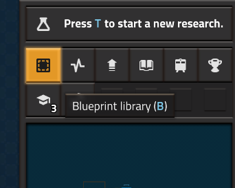

# GEARNOMICON ⚙️

Here's my personal book of blueprints for Factorio playthroughs to easen refactoring and starting from scratch. Also to share my friends and teach them how to play the game from a solid foundation.

Most of the blueprints are modular using a 50x50 cell grid based on roboport range. The entire base can be covered with roboports and keep expanding without manual input (as long as you have sufficient resources). It heavily uses a [train network system similar to LTN](https://www.youtube.com/watch?v=G9GWl4X2ln0) and modular city cells and blocks (2x2 cells).

- [Gearnomicon ⚙️](GEARNOMICON.txt) - The main book with multiple blueprints.
- [Global Filters 🔧](GLOBAL_FILTERS.txt) - A compact book with my commonly used filters to deconstruct, upgrade, or filter out buildings.

**Space Age *partially* included!** As I've not reached Aquilo and late-game techs reliably yet... Fear not! I will continue to contribute to this book.

## How to import?

You can import the book anytime in the game with the <kbd>Import String</kbd> button in the right side of the toolbox, as displayed below:

Copy raw file as demonstrated above then paste the **gigantic string** inside [Factorionomicon](FACTORIONOMICON.txt) in the propmpt, and voilà!

Also remember to use the in-game <kbd>Blueprint library</kbd> so you can access the book between savefiles seamlessly. Check the first button on the top-right hud (alternatively, press <kbd>[B]</kbd>):

That's it! Hope this helps!
